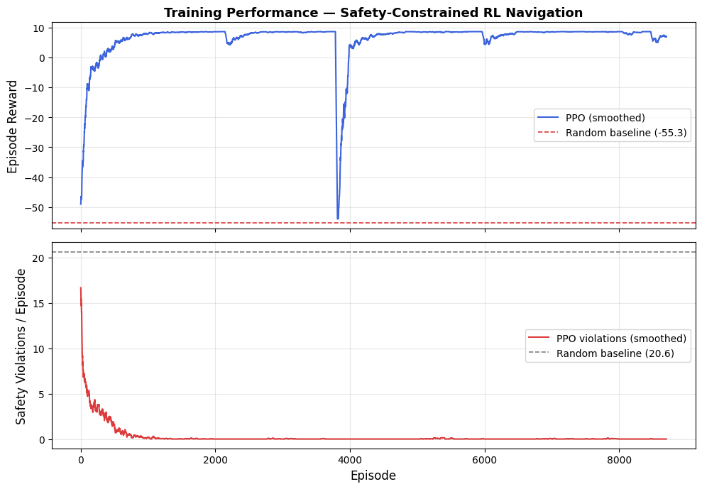
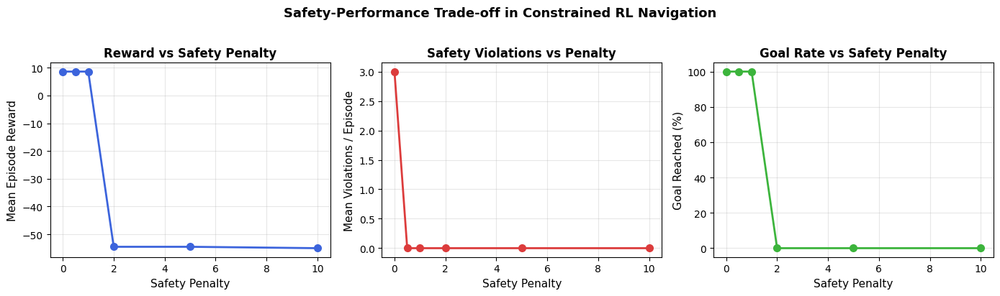

# Safety-Constrained Reinforcement Learning Navigation

[](YOUR_COLAB_NOTEBOOK_LINK_HERE)

A clean, minimal Custom Gymnasium environment built to study the fundamental tension between reward maximization and constraint satisfaction in Reinforcement Learning (RL). This project implements a custom 8 × 8 grid world, trains a Proximal Policy Optimization (PPO) agent using Stable-Baselines3, and tracks task performance and safety violations independently to evaluate safety-critical deployment trade-offs.

This problem mirrors real-world AI alignment challenges, such as balancing helpfulness vs. harmlessness via penalty coefficients during RLHF or implementing safe trajectory generation in robotics.

---

## 🚀 Quick Start

You can run this project instantly in your browser via Google Colab by clicking the badge above, or run it locally:

```bash
# Clone the repository
git clone https://github.com/YOUR_USERNAME/safety-constrained-rl.git
cd safety-constrained-rl

# Install dependencies
pip install gymnasium stable-baselines3 matplotlib numpy
```

---

## 🟦 Environment & Layout Design

The custom environment `SafetyGridEnv` constructs an 8x8 grid layout:

- **Start State:** The agent begins at the top-left coordinate `(0, 0)`
- **Goal State:** The target is located at the bottom-right coordinate `(7, 7)`
- **Safety-Constrained Zones:** Red zones act as restricted spaces where safety violations are tracked and penalized

### Reward Structure

| Event | Reward / Penalty | Description |
|------|------------------|------------|
| Reach Goal | +10.0 | Successfully completes the episode |
| Safety Zone Entry | -2.0 (configurable) | Penalizes constraint violations |
| Each Step | -0.1 | Encourages efficiency |
| Hit Wall | -0.5 | Movement blocked with penalty |

---

## 📊 Core Research Experiment & Results

The main objective is:

**How does the magnitude of the safety penalty affect the agent’s behavior?**

We test multiple penalty values:
`0.0, 0.5, 1.0, 2.0, 5.0, 10.0`

This produces a trade-off curve between performance and safety.

### 1. Training Curves

The agent is trained for 150,000 timesteps against a random baseline.

<p align="center">
  
</p>

### 2. Safety vs Performance Trade-off

Higher penalties lead to safer but longer paths.

<p align="center">
  
</p>

---

## 🛠️ Extensions & Future Work

Planned improvements:

1. **True Constrained RL (CMDP)**  
   Separate constraint costs from reward and optimize using Lagrangian methods such as CPO

2. **Partial Observability**  
   Replace full grid visibility with a local 3x3 observation window

3. **Generalization / Distribution Shift**  
   Randomize safety zone placement to test robustness
